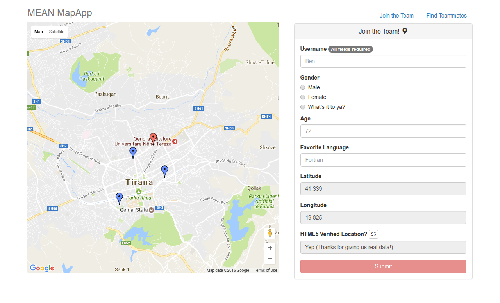
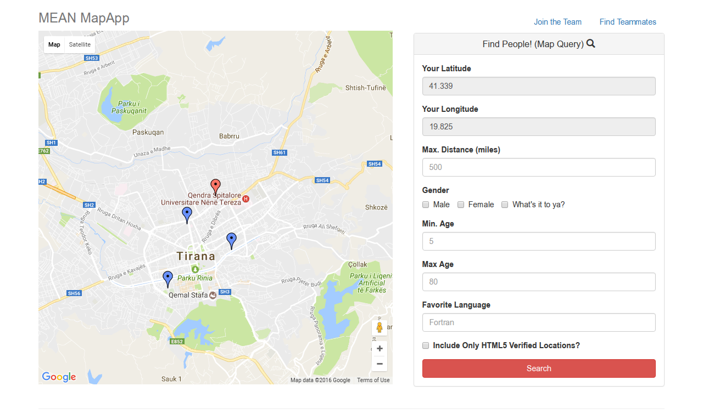

# mapAngular

A MEAN stack app using google maps API. You can add yourself to this map or you can find other developers near you depending on age, distance, gender or favorite programming language.

As always to use this repo clone it to your computer, run "npm install" and then "node server.js" in your terminal and open localhost:3000 in your browser.

